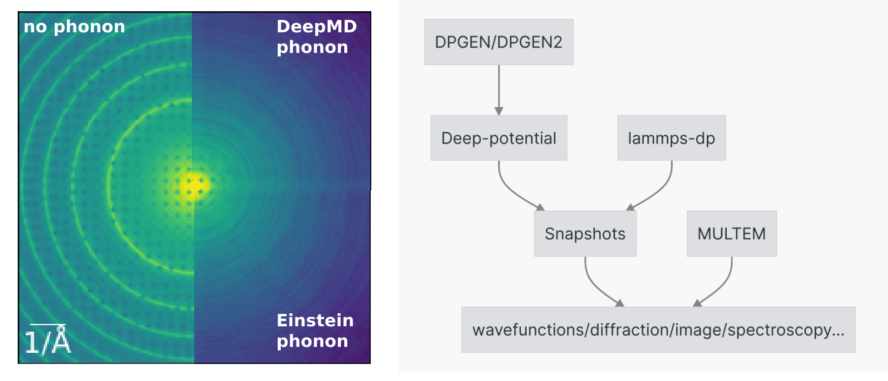

<!-- ABOUT THE PROJECT -->
## About The Project



Scanning transmission electron microscopy (STEM) is widely used for probing the crystal structure, chemistry and electronic structure at the atomic scale. To quantify the observed signals, we need to run detailed electron scattering simulations using the multislice algorithm -- treating materials as collections of slices (i.e. atomic planes) that electrons get scattered at those slices and freely propagate between slices. 

Among different contributions, thermal diffuse scattering dominates the observed diffraction intensities at high angles. Since the incident electrons travel fast as compared to the vibration period of the atoms, the atoms are seen as a frozen snapshot. The traditional frozen phonon calculation uses the uncorrelated Einstein model of phonons generation that displaces atoms in 2D with Dybe-Waller factors extracted from bulk experimental measurements or simulations. This approach clearly breaks down for atoms at the surface of nanoparticles or at the interface of heterophase which are of general interest to material science. In addition, the detailed phonon correlation and anisotropy may affect the fine structure of imaging, diffraction and spectroscopy that are largely unexplored until now. 

To close this gap, here we developed a workflow (based on dflow) to use realistic phonon configurations generated from deep potential molecular dynamics for electron scattering simulations. For the molecular dynamics, we designed a heating strategy to reach the targeted thermal equilibrium with DeepMD potential and EAM potential tested. For the scattering simulation, the STEM intensity was calculated for each phonon configuration and then incoherently summed over phonon configurations. After testing the bulk crystal cases, we will explore surfaces, interfaces and crystal defects which are otherwise difficult for conventional frozen phonon scattering simulations. 

The code is still in its early stage and heavily under development. 


### Built With

To run the workflow, please install the following packages:

- [dflow](https://github.com/deepmodeling/dflow)
- [python-multem](https://github.com/rosalindfranklininstitute/python-multem)
- [lammps-dp](https://anaconda.org/deepmodeling/lammps-dp)
- [phononpy](https://github.com/phonopy/phonopy)
- [phonoLAMMPS](https://pypi.org/project/phonoLAMMPS/)


<!-- GETTING STARTED -->
## Getting Started

To get code running locally, let's first create a conda environment.

```bash
conda create -n deepmd-em python=3.8
conda activate deepmd-em
```

Then, install the required packages.

### Prerequisites

* dflow
```sh
pip install pydflow
```
* python-multem
```sh
export CUDACXX=${PATH_TO_CUDA}/bin/nvcc
python -m pip install git+https://github.com/rosalindfranklininstitute/python-multem.git@master
```
* lammps-dp
```sh
conda install -c deepmodeling lammps-dp
```
* phononpy
```sh
pip install phonopy
```
* phonoLAMMPS
```sh
pip install phonoLAMMPS
```
### Installation

Then we can install the DeepMD-EM code.

```sh
git clone https://github.com/zezhong-zhang/DeepMD-EM.git
pip install -e DeepMD-EM
```


<!-- USAGE EXAMPLES -->
## Usage

To run the workflow, please check the [tutorials](https://github.com/zezhong-zhang/DeepMD-EM/tree/master/tutorial) for the MD simulation, phonon calculation and the scattering simulation.

_The proper [Documentation](https://deepmd-em.readthedocs.io/en/latest/) is under construction_


<!-- ROADMAP -->
## Roadmap
### Science
- [x] Check the Debye-Waller factors in agreement with experiments
- [x] Check the phonon DOS and band strcuture in agreement with DFT
- [ ] Compare STEM scattering cross-sections from the DeepMD and Einstein model results
- [ ] Explore surfaces, interfaces and crystal defects and investigate the phonon effects for atom counting under realistic doses
### Engineering
- [ ] Add phonon calculations to dflow OP
- [ ] Add multem calculations to dflow OP
- [ ] Add unit tests
- [ ] Add documentation


See the [open issues](https://github.com/zezhong-zhang/DeepMD-EM/issues) for a full list of proposed features (and known issues).


<!-- CONTRIBUTING -->
## Contributing

Contributions are what make the open source community such an amazing place to learn, inspire, and create. Any contributions you make are **greatly appreciated**.

If you have a suggestion that would make this better, please fork the repo and create a pull request. You can also simply open an issue with the tag "enhancement".
Don't forget to give the project a star! Thanks again!

1. Fork the Project
2. Create your Feature Branch (`git checkout -b feature/AmazingFeature`)
3. Commit your Changes (`git commit -m 'Add some AmazingFeature'`)
4. Push to the Branch (`git push origin feature/AmazingFeature`)
5. Open a Pull Request


<!-- LICENSE -->
## License

Distributed under the GPLv3 License. See `LICENSE.txt` for more information.


<!-- CONTACT -->
## Contact

Zezhong Zhang - zezhong.zhang@uantwerpen.be

Project Link: [https://github.com/zezhong-zhang/DeepMD-EM](https://github.com/zezhong-zhang/DeepMD-EM)


<!-- ACKNOWLEDGMENTS -->
## Acknowledgments

* Thanks to Dr. Ivan Lobato, Prof. Sandra Van Aert and Prof. Dirk Lamoen for their support and suggestions.
* Readme page based on [Best-README-Template](https://github.com/othneildrew/Best-README-Template)


<!-- MARKDOWN LINKS & IMAGES -->
<!-- https://www.markdownguide.org/basic-syntax/#reference-style-links -->
[contributors-shield]: https://img.shields.io/github/contributors/zezhong-zhang/DeepMD-EM.svg?style=for-the-badge
[contributors-url]: https://github.com/zezhong-zhang/DeepMD-EM/graphs/contributors
[forks-shield]: https://img.shields.io/github/forks/zezhong-zhang/DeepMD-EM.svg?style=for-the-badge
[forks-url]: https://github.com/zezhong-zhang/DeepMD-EM/network/members
[stars-shield]: https://img.shields.io/github/stars/zezhong-zhang/DeepMD-EM.svg?style=for-the-badge
[stars-url]: https://github.com/zezhong-zhang/DeepMD-EM/stargazers
[issues-shield]: https://img.shields.io/github/issues/zezhong-zhang/DeepMD-EM.svg?style=for-the-badge
[issues-url]: https://github.com/zezhong-zhang/DeepMD-EM/issues
[license-shield]: https://img.shields.io/github/license/zezhong-zhang/DeepMD-EM.svg?style=for-the-badge
[license-url]: https://github.com/zezhong-zhang/DeepMD-EM/blob/master/LICENSE.txt
[linkedin-shield]: https://img.shields.io/badge/-LinkedIn-black.svg?style=for-the-badge&logo=linkedin&colorB=555
[linkedin-url]: https://linkedin.com/in/zezhong-zhang-062a0838