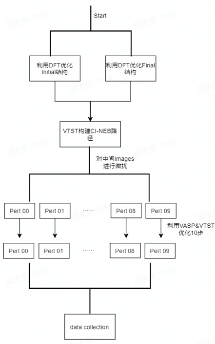

# dflow: CI-NEB combined with Pertubation to build the initial train set of DPGEN

## Introduction
This dflow proposal is used to construct the initial data set for dpgen iteration. The quality of the initial dataset will have a significant impact on the iterative convergence process. A good initial trainset can often accelerate the convergence. DeePMD has been widely used in the study of chemical reactions. In the current case, we always try to make an initial dataset which contains some configurations along the reaction path. In the framework of the DFT, CI-NEB is a common method used to exploring the reaction path and barrier between reactant and products, and give a relatively reliable transition state configuration. In order to increase the richness of the dataset, the intermediate images can be further perturbed, and then the VTST version of VASP can be used to optimize the intermediate image. The number of optimization steps should not be too many (e.g., 10 steps is sufficient), because the configuration change is not obvious after optimization to a certain number of steps. Sampling efficiency is not substantially improved.

## Workflow

 Figure 1. The dflow diagram for CI-NEB+Pertubation.

## How to use
All codes have been written in code.py file. If you want to use it, don't forget modify the "slurm_remote_executor" according to your cluster information. 
pert.json is the input parameter file. All information related to this workflow can be found in pert.json file. 

## Bug Report
If you find bugs when using, please contact with me (taipinghu@pku.edu.cn).

