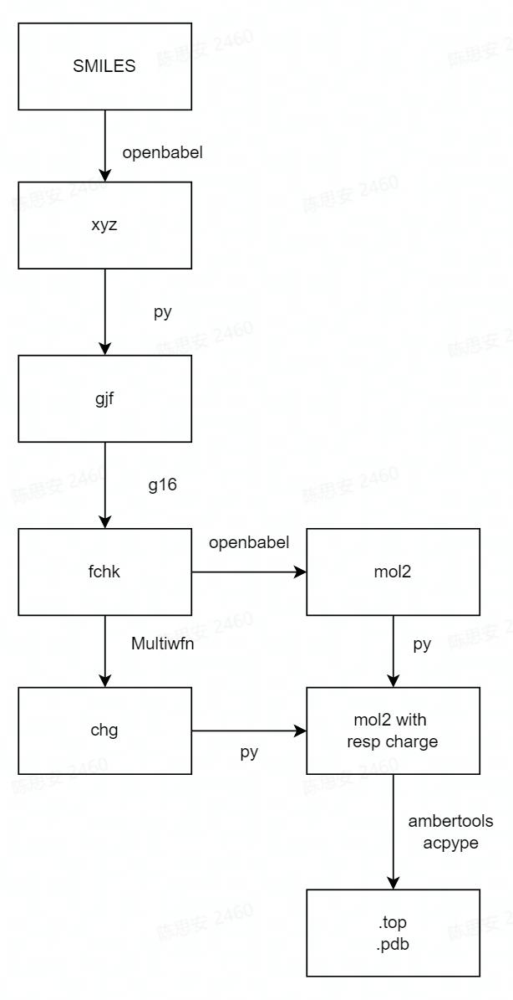

<a name="hLL2r"></a>
# Introduction
This workflow is developed based on [dflow](https://github.com/dptech-corp/dflow), aiming to obtain the force field (FF) file required for molecular dynamics simulation generated from SMILEs formatted string. This workflow relies on variety of softwares and python libraries through PythonOP, and with good transferbility between different platfoms (by switching executors).

The whole workflow process is shown as follows:
<a name="wfQUC"></a>
# details
<a name="93xcm"></a>
## workflow

<a name="8rToP"></a>
## step1  generate g16 input file from SMILEs

files in 1_gengjf/ directory：<br />1_gengjf/<br />├── electrolyte.json<br />├── ethane_to_compare.gjf<br />└── wf_gengjf.py

The filed  "SMI" : [CC] in _electrolyte.json_ provides the SMILEs of the molecule to be converted. Here, "CC" (the SMILEs representation of ethane)is taken as an example


change the executor in _wf_gengjf.py_ to your available maehine,  in whihc _openbabel_ model is relied，execute:
```
python wf_gengjf.py
```
Finally one file called ethane.gjf would be generated, and the contents of this file should be the same as ethane_ to_ Compare.gjf except for the Cartesian coordinates

<a name="OUi1b"></a>
## step2 DFT calculation
In this step,  the .gjf file generated in the previous step would be submitted, and Gaussian 16 will be used to perform DFT calculation, and then return the .log file and .fchk file.

files in 2_DFTcalc/ directory：<br />2_DFTcalc/<br />├── filesIO<br />│   └── DME_1.gjf<br />└── wf_DFT.py

Change the extractor in _wf_DFT.py_ to an available machine, and  G16 and formchk executable files. To submit this step, execute:
```
python wf_DFT.py
```
results:<br />├── filesIO<br />│   ├── DME_1.gjf<br />│   ├── out.fchk<br />│   └── out.log
<a name="4eYNE"></a>
## Step 3: partial charge by RESP
 Based on the  geometry optimization and wave function from the calculated DFT,  This step obtains the partial charge of atoms through the RESP fitting process using _Multiwfn_. Since the mol2 file can record the partial charge together with the optimized geometry, and the resp charge are finally written into a mol2 file for subsequent calculation.<br />files in 3_1_ESPcalc_genESP/ directory：<br />3_1_ESPcalc_genESP/<br />├── filesIO<br />│  ├── out.fchk<br />│   └── out.mol2<br />└── wf_calcRESP.py

Similarly, change the extractor  in wf_calcRESP.py to an available machine,  and _Multiwfn_ and _openbabel_ is required . To submit this step, execute:
```
python wf_calcRESP.py
```
After completed, out.mol2 would be downloaded to ./filesio. The directory structure is as follows:<br />3_1_ESPcalc_genESP/<br />├── filesIO<br />│   ├── out.fchk<br />│   └── out.mol2<br />└── wf_calcRESP.py

<a name="DywVl"></a>
## Step 4: force field generation
This step realizes the automtic generation of a topology file based on the GAFF force field or the OPLS-AA force field from the calculated DFT optimization geometry and the resp fitting charge (out. mol2).

Files in the directory tree:<br />3_2_acpype/<br />├── filesIO<br />│   └── out.mol2<br />└── wf_genFF.py

Change the extractor  in wf_genFF.py to an available machine,  and ambertools and acpype is required . To submit this step, execute:
```
python wf_genFF.py
```
All files would be downloaded:<br />3_2_acpype/<br />├── filesIO<br />│  ├── gen_FF.sh<br />│  ├── leap.in<br />│  ├── leap.log<br />│  ├── Lig.frcmod<br />│  ├── Lig.inpcrd<br />│  ├── Lig.mol2<br />│  ├── Lig.prmtop<br />│  ├── out.mol2<br />│  └── UNL.amb2gmx<br />│    ├── acpype.log<br />│    ├── em.mdp<br />│    ├── md.mdp<br />│    ├── posre_UNL.itp<br />│    ├── rungmx.sh<br />│    ├── UNL_GMX.gro<br />│    └── UNL_GMX.top<br />└── wf_genFF.py


